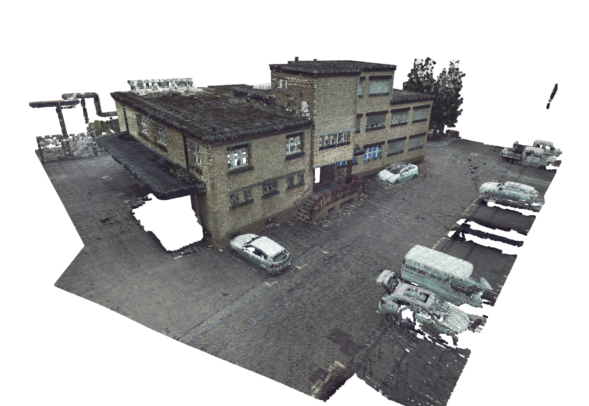
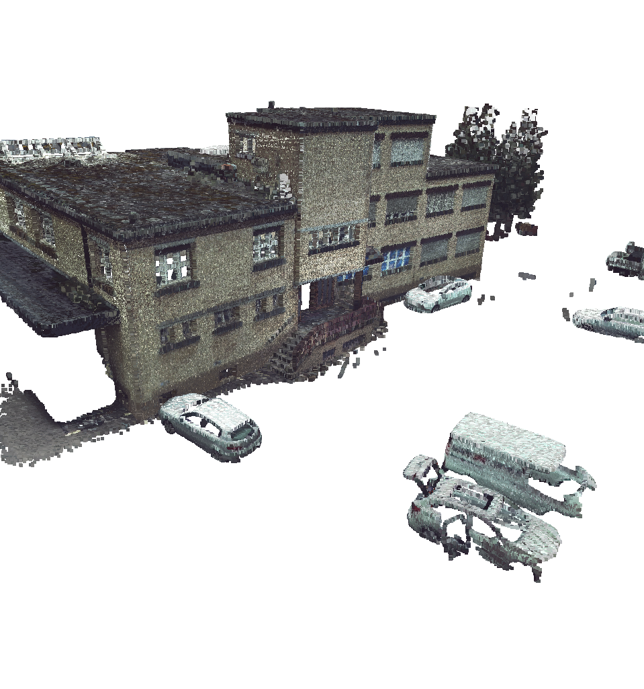
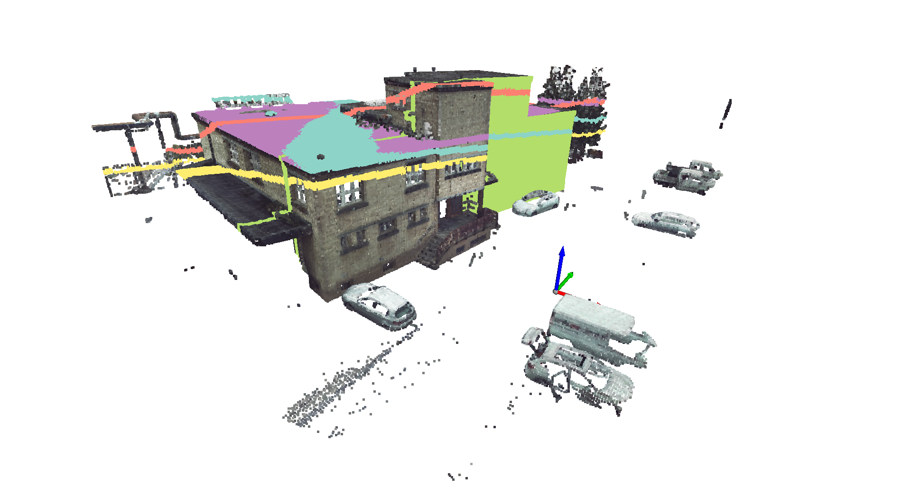
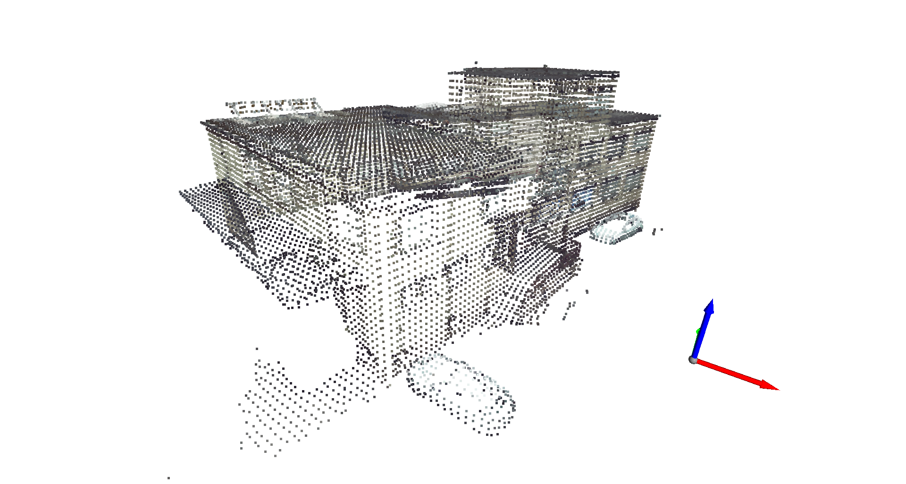
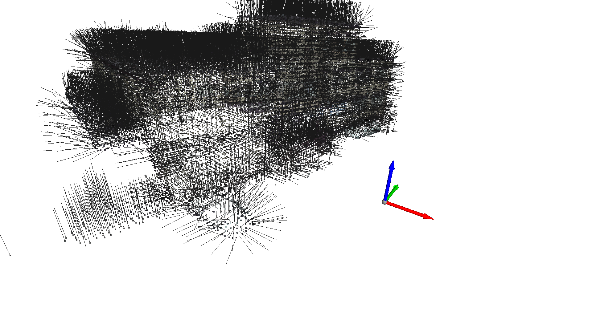
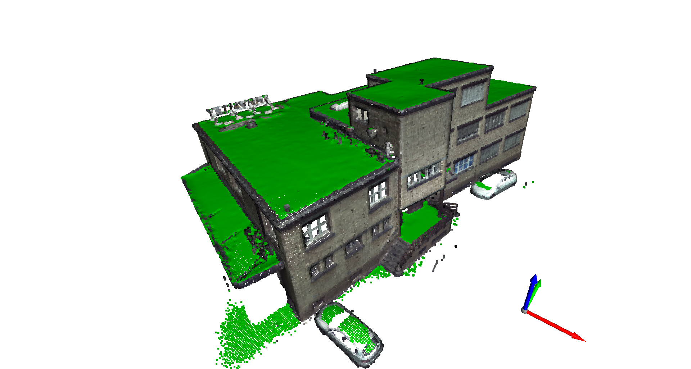
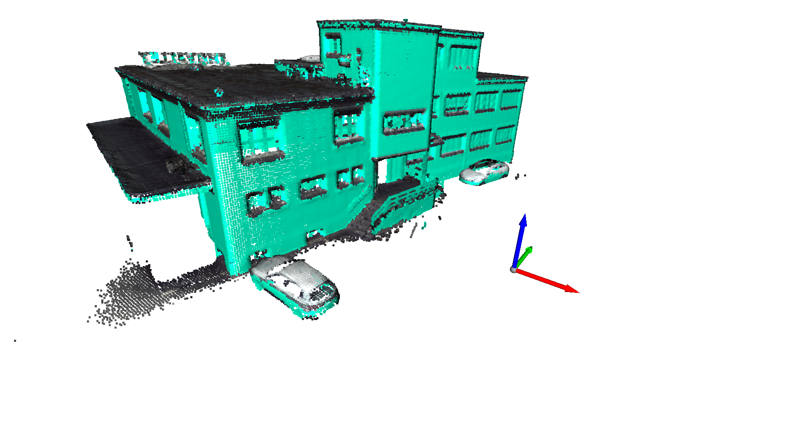

Parte 09 - SAVI
==============
Miguel Riem Oliveira <mriem@ua.pt>
2025-2026

# Sumário

Point cloud processing
RANSAC 
Open3d

# Exercícios

## Exercício 1

Carregue a nuvem de pontos "factory.ply" e faça o _display_ em [Open3D](http://www.open3d.org/docs/release/tutorial/geometry/pointcloud.html).

Configure também um ponto de vista inicial semelhante ao que se vê na imagem, e implemente o código necessário para que o visualizador inicie sempre o programa desse ponto de vista.

## Exercício 2

Faça um programa que remova os pontos do chão e grave uma nova nuvem de pontos.

## Exercício 3

Pretende-se localizar as fachadas do edifício do exercício anterior, tendo em conta que são superfícies planares.

Partindo da point cloud to exercício anterior (sem o chão), utilize o algoritmo de RANSAC para fazer segmentação de planos na nuvem de pontos.
O sistema deve segmentar sucessivamente a nuvem dos pontos sobrantes do processo anterior, de forma a encontrar vários planos na cena.

O exercício anterior mostra as limitações do algoritmos RANSAC. Há planos corretamente detetados, como são os casos dos planos a verde e rosa, mas há outros que estão claramente errados, como são os planos a amarelo e laranja. 

Para melhorar este resultado, os pontos devem ser agrupados pela orientação das suas normais, de modo a guiar o algoritmo de RANSAC.

Os próximos exercícios exemplificam o procedimento.

## Exercício 4

Faça uma amostragem de pontos de 0.3 em 0.3 metros usando o voxel grid filter e mostre a nuvem de pontos resultante. Use também o [Euclidean clustering](http://www.open3d.org/docs/latest/tutorial/Basic/pointcloud.html#DBSCAN-clustering) para isolar o edifício dos restantes objetos. 

## Exercício 5

Calcule as normais para os pontos filtrados no exercício anterior.

## Exercício 6

Extraia da nuvem de pontos apenas os pontos que têm uma normal próxima da orientação vertical, e assinale-os a verde.

## Exercício 7

Extraia da nuvem de pontos apenas os pontos que deverão pertencer a uma superfície vertical e assinale-os a azul.

## Exercício 8

Utilize a filtragem dos pontos pelas suas normais para guiar o algoritmo de RANSAC e assim evitar a deteção de planos como os assinalados a amarelo e laranja no exercício 2.

O programa deverá detetar as superfícies horizontais do edifício, i.e., o terraço e as varandas, bem como as superfícies verticais como as paredes.

