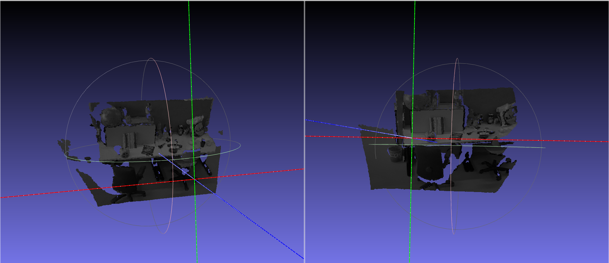

Parte 08 - SAVI
==============
Miguel Riem Oliveira <mriem@ua.pt>
2025-2026

# Sumário

Iterative Closest Point

# Exercícios

## Exercício 1

Faça o download dos dados de point clouds deste link:

https://drive.google.com/file/d/1JzZdc9YyyvMIbHE83DAdyUe9J8poW0hj/view?usp=sharing

Use o software **cloud compare** para fazer o registo entre duas nuvens de pontos.

## Exercício 2 - rgb + depth para point cloud

As câmaras rgbd são sensore que adquirem imagens rgb e imagens de profundidade.
É muitas vezes necessário fazer a conversão deste formato para uma nuvem de pontos.

Na pasta **tum_dataset** encontra dois exemplos de imagens rgb e das imagens de profundidade correspondentes.

Carregue as duas imagens de rgb e as de profundidade correspondentes. Depois crie duas imagens rgbd seguindo o tutorial:

https://www.open3d.org/docs/latest/tutorial/Basic/rgbd_image.html

Grave as duas nuvens de pontos para disco como 1.ply e 2.ply

## Exercício 3

Faça o tutorial de [iterative closest point do open3d](https://www.open3d.org/docs/latest/tutorial/pipelines/icp_registration.html) com as nuvens de pontos obtidas no exercício 2.

## Exercício 3 - esfera que engloba todos os pontos

Acrescente à otimização anterior os parâmetros de posição do centro (xc,yc e zc) e raio (r) de uma esfera que contenha todos os pontos.

A esfera deve ser a menor possível, mas todos os pontos das núvens de pontos 1 e 2 deverão estar dentro dela.

