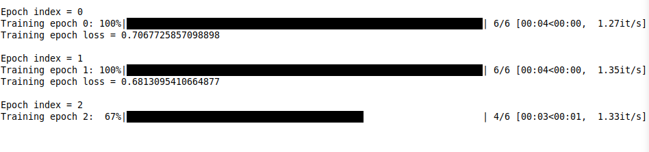
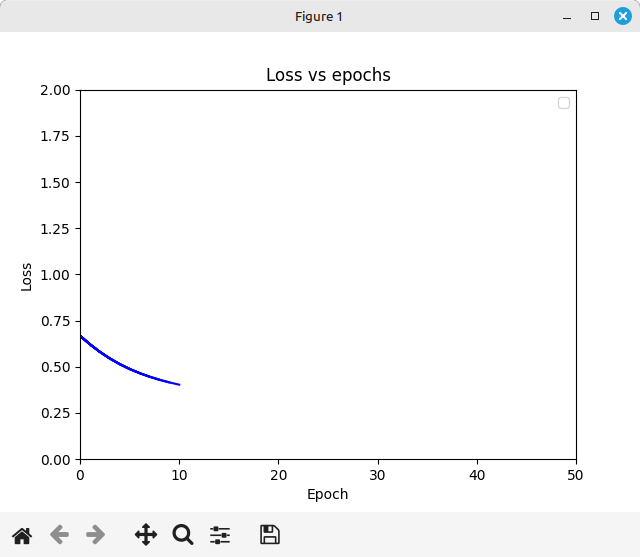
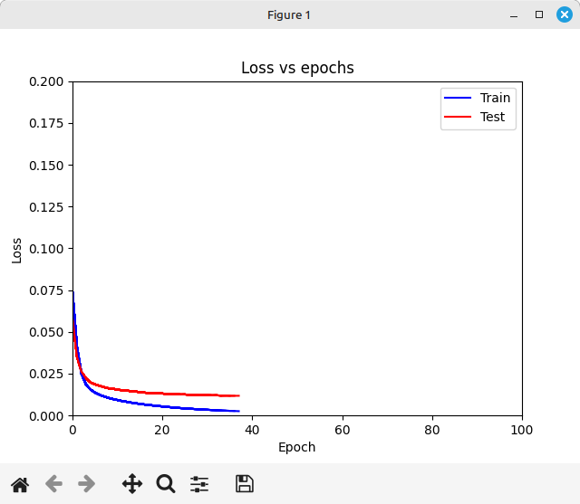
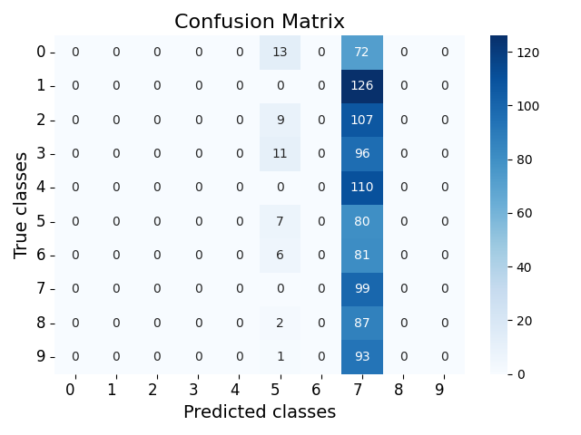
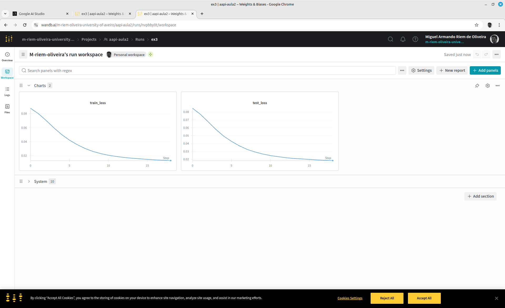

# Parto 10 — Ferramentas de visualização da performance do treino

Esta aula aborda ferramentas essenciais para monitorizar, avaliar e otimizar o desempenho dos modelos de Machine Learning. No treino de redes neurais, é crucial não só executar o código, mas também compreender o seu funcionamento interno e os resultados gerados.
Nesta sessão, será explorado como:
- Visualizar o progresso do treino em tempo real, acompanhando a evolução da função de perda (loss).
- Avaliar o verdadeiro desempenho do modelo em dados nunca antes vistos, utilizando métricas robustas como a Matriz de Confusão, Precision, Recall e F1-Score.
- Implementar mecanismos para gravar e retomar um treino que foi interrompido, salvaguardando o progresso alcançado.
- Utilizar plataformas avançadas como o Weights & Biases para gerir e comparar as experiências de forma eficiente.

O objetivo final é fornecer as competências necessárias para diagnosticar problemas como o overfitting, tomar decisões informadas sobre os modelos e, em última análise, construir soluções de Machine Learning mais eficazes e robustas.

---

## Exercícios

Partindo do código realizado na última aula, vamos explorar vários aspetos do treino das redes. 

### Ex1 Desenhar o progresso da aprendizagem

**a)**  
Utilize a [biblioteca tqdm](https://pypi.org/project/tqdm/2.2.3/) para visualizar o progresso do treino de cada época com uma barra na linha de comandos.



**b)**  
Implemente um mecanismo que defina com parâmetros de linha de comando qual a percentagem dos exemplos do dataset a utilizar. 

Nos próximos exercícios use apenas uma percentagem pequena de exemplos (e.g. 10% de exemplos e batch_size de 256) para conseguir visualizar resultados mais rapidamente.


**c)**  

use a [biblioteca matplotlib](https://matplotlib.org/stable/api/_as_gen/matplotlib.pyplot.plot.html) para fazer os desenhos, e implemente um método  **`draw`** na classe Trainer.

Faça o desenho da curva da loss vs num_epoch para o dataset de treino chamado o método draw a cada final de época.



**d)**  

Faça o calculo da loss para o dataset de teste e desenhe em conjunto com a loss do dataset de treino.

Que diferenças observa entre as curvas de treino e teste? O conceito de overfitting.



### Ex2 Métricas de avaliação

Para avaliar o desempenho de um modelo de classificação num conjunto de dados de teste, especialmente em problemas de classificação multiclasse como o MNIST, utilizamos métricas como a Precision, o Recall e o F-Score. 

#### matriz de Confusão

A matriz de confusão é uma ferramenta fundamental para visualizar o desempenho de um algoritmo de classificação. Cada linha da matriz representa as classes reais (o que o modelo devia ter previsto), enquanto cada coluna representa as classes previstas pelo modelo. Os valores nas células indicam o número de amostras que se enquadram em cada combinação de classe real e classe prevista. É a partir desta matriz que derivamos os conceitos de Verdadeiros Positivos, Falsos Positivos, Falsos Negativos e Verdadeiros Negativos, que são a base para o cálculo das métricas de avaliação.

#### Fundamentos: Verdadeiros Positivos, Falsos Positivos e Falsos Negativos

A partir da matriz de confusão, podemos extrair os seguintes conceitos essenciais, que são cruciais para compreender as métricas de desempenho:
Verdadeiros Positivos (TP - True Positives): Amostras que pertencem à classe positiva e foram corretamente classificadas como positivas pelo modelo. Estão localizadas na diagonal principal da matriz, onde a classe real é igual à classe prevista e é a classe de interesse.
Falsos Positivos (FP - False Positives): Amostras que pertencem à classe negativa, mas foram incorretamente classificadas como positivas pelo modelo (Erro Tipo I). Na matriz de confusão, seriam as previsões de uma classe de interesse quando a classe real era outra.
Falsos Negativos (FN - False Negatives): Amostras que pertencem à classe positiva, mas foram incorretamente classificadas como negativas pelo modelo (Erro Tipo II). Na matriz de confusão, seriam as amostras da classe de interesse que foram previstas como pertencentes a outra classe.
Verdadeiros Negativos (TN - True Negatives): Amostras que pertencem à classe negativa e foram corretamente classificadas como negativas pelo modelo. Na matriz, seriam as amostras de outras classes que foram corretamente previstas como sendo essas outras classes.

#### Métricas de Avaliação

##### Precision (Precisão)

A Precision mede a proporção de identificações positivas que foram realmente corretas. Por outras palavras, ela responde à pergunta: "Das vezes que o modelo previu 'X', quantas vezes acertou?". Uma alta precisão indica uma baixa taxa de falsos positivos, ou seja, o modelo é bom a não classificar erradamente algo como sendo da classe positiva quando na verdade não é.
Fórmula:

$Precision = \frac{TP}{TP + FP}$

No MNIST (reconhecimento de dígitos de 0 a 9), se estivermos a calcular a precisão para o dígito '7', os TPs seriam as imagens de '7' que o modelo classificou corretamente como '7'. Os FPs seriam imagens de outros dígitos (por exemplo, '1', '2', '8') que o modelo erroneamente classificou como '7'. Uma alta precisão para '7' significa que poucas imagens que não eram '7' foram classificadas como '7'.

##### Recall (Sensibilidade)

O Recall mede a proporção de todas as amostras positivas reais que foram corretamente identificadas pelo modelo. Ele responde à pergunta: "De todas as amostras 'X' reais, quantas o modelo conseguiu capturar?". Um alto recall indica uma baixa taxa de falsos negativos, o que significa que o modelo é bom a encontrar todas as instâncias da classe positiva.

$Recall = \frac{TP}{TP + FN}$
 
Para o dígito '7' no MNIST, os TPs são os mesmos da precisão. Os FNs seriam as imagens reais de '7' que o modelo falhou em identificar, classificando-as como outro dígito (por exemplo, uma imagem de '7' classificada como '1' ou '9'). Um alto recall para '7' significa que o modelo conseguiu identificar a maioria das imagens que eram realmente '7'.

##### F1-Score
O F1-Score é a média harmónica ponderada da Precision e do Recall. Procura um equilíbrio entre as duas métricas e é especialmente útil quando há um desequilíbrio na distribuição das classes. Um F1-Score de 1.0 indica precisão e recall perfeitos, enquanto 0.0 indica que um ou ambos falharam completamente.

$F1_{score} = \frac{Precision \times Recall}{Precision + Recall}$

O F1-Score para cada dígito no MNIST combinaria a precisão e o recall específicos para aquele dígito, fornecendo uma medida única de quão bem o modelo se está a sair para identificar aquela classe em particular, considerando tanto os erros de falso positivo (impacto na precisão) quanto os de falso negativo (impacto no recall).

O MNIST é um problema de classificação multiclasse (10 classes: 0 a 9). Para esses problemas, as métricas de Precision, Recall e F1-Score são geralmente calculadas "por classe" (abordagem um-contra-todos), e depois agregadas usando diferentes métodos para fazer a média. A aplicação destas métricas a um dataset de teste, como o MNIST, fornece uma avaliação abrangente do desempenho do modelo, permitindo identificar pontos fortes e fracos na classificação de cada dígito e no desempenho geral.


**a)**  

Implemente um método **`evaluate`** para calcular e desenhar a matriz de confusão para o dataset de teste. 



**b)**  

Calcule e imprima os valores de TP, FP e FN para cada classe.

Crie um dicionário denominado **statistics** com a seguinte estrutura (alguns campos só serão calculados nas alíneas seguintes):

```json
{
  "classes": [
    {
      "digit": "0",
      "TP": 0,
      "FP": 0,
      "FN": 85,
      "precision": null,
      "recall": 0.0,
      "f1_score": null
    },
    {
      "...": "... all other digits ...",
    },
    {
      "digit": "9",
      "TP": 0,
      "FP": 0,
      "FN": 94,
      "precision": null,
      "recall": 0.0,
      "f1_score": null
    }
  ],
  "global": {
    "TP": 106,
    "FP": 894,
    "FN": 894,
    "precision": 0.106,
    "recall": 0.106,
    "f1_score": 0.106
  }
}
```

**c)**  

Calcule e imprima os valores de TP, FP e FN globais.

**d)**  

Calcule e imprima os valores de Precision, Recall e F1-Score por classe e globais.

**e)**  

Grave o dicionário **statistics** a cada iteração no ficheiro **statistics.json**.


---

### Ex3 Visualiação com a biblioteca Weights and Biases

O weights and biases é uma biblioteca muito utilizada para monitorizar a realização de várias experiências. É atualmente um standard da indústria.

**a)**  

Faça o signup no site do [weights and biases](https://wandb.ai/site/). Depois instale a biblioteca com o comando:

    pip install wandb

Depois faça o login com a sua chave api, que pode consultar no site

    wandb login


**b)** 

Usando estas [instruções](https://docs.wandb.ai/quickstart/), acrescente o código necessário para fazer o log do treino no weights and biases.





**c)**

Adicione todos os seguintes campos ao loggin to weights and biases para ter uma monitorizaçãp completa. 

  - Losses: train_loss, test_loss (por época).
  - Métricas: precision, recall, f1_score (globais e/ou por classe, se a granularidade for importante). Altere o cálculo de modo a que seja feito em todas as épocas.
  - Matriz de confusão: wandb.log() pode ser usado para registar os gráficos gerados com matplotlib (e.g., wandb.log({"confusion_matrix": wandb.Image(confusion_matrix_plot)}).

## O que aprendemos nesta aula?

- A importância da visualização do progresso (tqdm, curvas de loss).
- Como avaliar o desempenho de um modelo de classificação usando métricas (Precision, Recall, F1-Score) e a Matriz de Confusão.
- A importância do checkpointing para resiliência do treino (salvar/carregar modelo e otimizador).
- Ferramentas modernas para monitoramento de experimentos (Weights & Biases).
- A compreensão do fenômeno de overfitting.